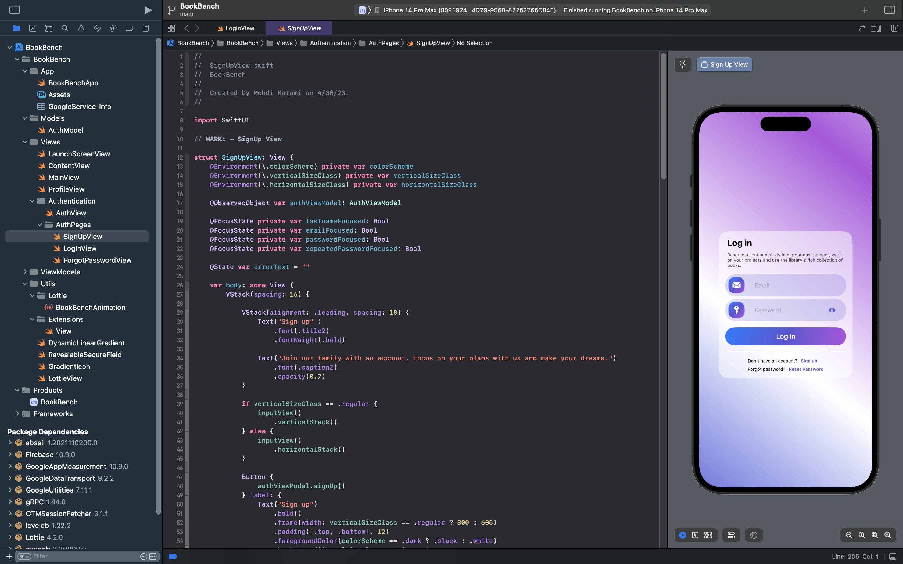

<p align="center">  </p>
<h1 align="center"> BookBench </h1>

**BookBench**, an innovative iOS application dedicated to simplifying the reservation of library seats, is progressing steadily with a focus on enhancing user experience through `SwiftUI` and a well-organized `MVVM architecture`.

The authentication section is a robust foundation, featuring `SignUp`, `LogIn`, and `Reset Password` functionalities seamlessly integrated using `Firebase` Authentication and Database. 
This ensures a secure and reliable user authentication process, laying the groundwork for a trustworthy application.

Additionally, a visually appealing launch screenView, accompanied by a captivating custom `Lottie animation`, creates a memorable user experience.

While the authentication section has been successfully implemented, the project welcomes further enhancements and additions to complement the existing features to create a comprehensive and user-friendly library seat reservation experience.


## Table of Contents

- [Project Diagram](#project-diagram)
- [Package Dependencies](#package-dependencies)
- [Contributing](#contributors)
- [License](#license)



## Project Diagram

```bash
.
├── BookBench
│   ├── App
│   │   ├── Assets.xcassets
│   │   │   ├── AccentColor.colorset
│   │   │   │   └── Contents.json
│   │   │   ├── AppIcon.appiconset
│   │   │   │   ├── Contents.json
│   │   │   │   └── icon.png
│   │   │   └── Contents.json
│   │   ├── BookBenchApp.swift
│   │   └── GoogleService-Info.plist
│   ├── Info.plist
│   ├── Models
│   │   └── AuthModel.swift
│   ├── Utils
│   │   ├── DynamicLinearGradient.swift
│   │   ├── Extensions
│   │   │   └── View.swift
│   │   ├── GradientIcon.swift
│   │   ├── Lottie
│   │   │   └── BookBenchAnimation.json
│   │   ├── LottieView.swift
│   │   └── RevealableSecureField.swift
│   ├── ViewModels
│   │   ├── AuthViewModel.swift
│   │   └── ContentViewModel.swift
│   └── Views
│       ├── Authentication
│       │   ├── AuthPages
│       │   │   ├── ForgotPasswordView.swift
│       │   │   ├── LogInView.swift
│       │   │   └── SignUpView.swift
│       │   └── AuthView.swift
│       ├── ContentView.swift
│       ├── LaunchScreenView.swift
│       ├── MainView.swift
│       └── ProfileView.swift
├── BookBench.xcodeproj
│   ├── project.pbxproj
│   ├── project.xcworkspace
│   │   ├── contents.xcworkspacedata
│   │   ├── xcshareddata
│   │   │   ├── IDEWorkspaceChecks.plist
│   │   │   ├── WorkspaceSettings.xcsettings
│   │   │   └── swiftpm
│   │   │       ├── Package.resolved
│   │   │       └── configuration
│   │   └── xcuserdata
│   │       └── mehdi.xcuserdatad
│   │           ├── UserInterfaceState.xcuserstate
│   │           └── WorkspaceSettings.xcsettings
│   └── xcuserdata
│       └── mehdi.xcuserdatad
│           ├── xcdebugger
│           │   └── Breakpoints_v2.xcbkptlist
│           └── xcschemes
│               └── xcschememanagement.plist
├── Documentation
│   └── icon.png
└── README.md
```
## Package Dependencies

[Firebase](https://github.com/firebase/firebase-ios-sdk) 

[Lottie iOS](https://github.com/airbnb/lottie-ios.git)

## Contributors

Feel free to share your ideas or any other problems. Pull requests are welcome! 
For major changes, please open an issue first to discuss what you would like to change.

## License

`Book Bench` is released under an MIT license. See [LICENSE](LICENSE) for more information.
